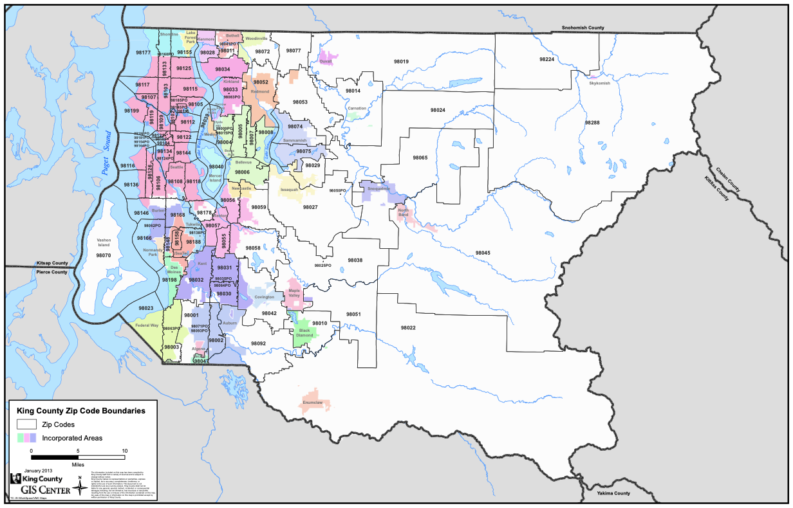
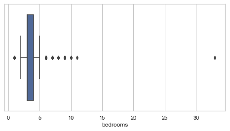
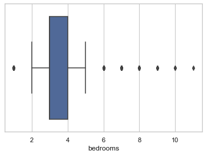
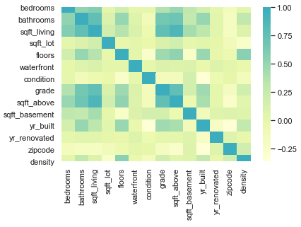
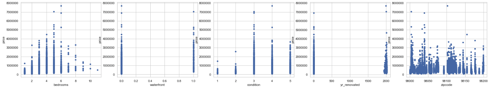
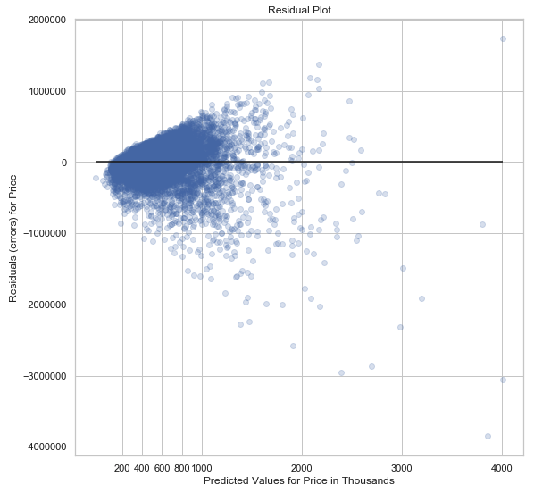
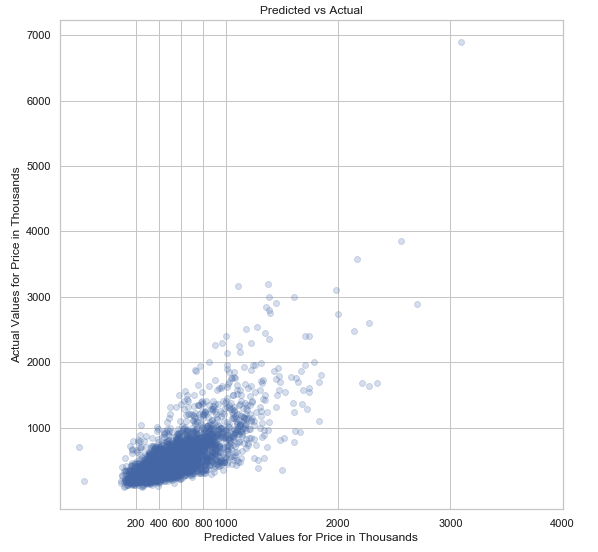
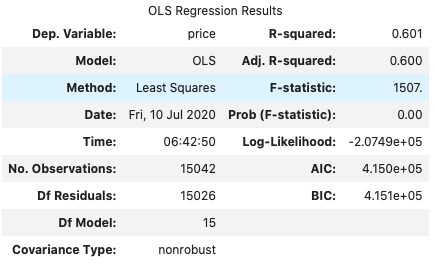
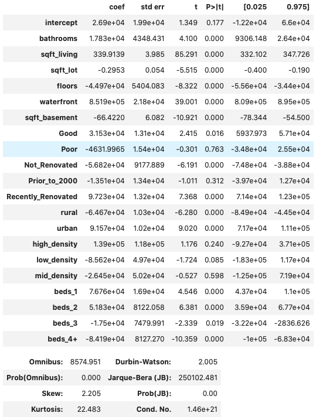

# Module 2 Final Project - Housing Price Analysis

## Introduction

This Readme lays out the details of the Module 2 Final Project for Clair Marie Wholean and Bobby Williams.

## Summary

We were tasked with analyzing the dataset in the "data" directory of this repository and to provide a linear regression model that could help answer the following questions:  
1) Which features predict the price of a home, and by how much?  
2) Does density, as defined by the ratio of living area to lot area, affect house price?  
3) What is the difference in price between urban and non-urban homes.  

## Repository Contents

- The Kings County House Sales dataset (kc_house_data.csv) was used for analysis is in the 'data' directory of this repo.
- A pdf copy of the presentation is included in the main directory of this repo.
- The "executive" jupyter notebook contains the code to process the dataset, create the model, and our analysis.
- Images for this README are stored in the 'media' directory of this repo.

## Data

The dataset contained 21,597 entries (18,804 were used after cleaning the data).  

The entries were for single-family homes sold over the course of one year between May of 2014 and May of 2015.  

The dataset column names and their descriptions are here:  
* **id** - unique identified for a house  
* **date** - date house was sold  
* **price** -  price is prediction target  
* **bedrooms** -  number of Bedrooms/House  
* **bathrooms** -  number of bathrooms/bedrooms  
* **sqft_living** -  square footage of the home  
* **sqft_lot** -  square footage of the lot  
* **floors** -  total floors (levels) in house  
* **waterfront** - House which has a view to a waterfront  
* **view** - Has been viewed  
* **condition** - How good the condition is ( Overall )  
* **grade** - overall grade given to the housing unit, based on King County grading system  
* **sqft_above** - square footage of house apart from basement  
* **sqft_basement** - square footage of the basement  
* **yr_built** - Built Year  
* **yr_renovated** - Year when house was renovated  
* **zipcode** - zip  
* **lat** - Latitude coordinate  
* **long** - Longitude coordinate  
* **sqft_living15** - The square footage of interior housing living space for the nearest 15 neighbors  
* **sqft_lot15** - The square footage of the land lots of the nearest 15 neighbors  

## Data Science Process Steps

#### Data Prep  
First the data was cleaned due to null values in the waterfront column and datatype issues in the sqft_basement column (these were removed). The data was also checked for outliers and those were removed accordingly.  
  
Bedrooms had an outlier. One house had over 30 bedrooms. Because this is so unusual, we decided to eliminate it.  

#### Determine Collinearity  

Checking for collinearity we found that we could exclude the 'sqft_above', 'grade', and 'yr_built' columns from the model.  

#### Assign Dummy Variables  

To handle categorical values we assigned dummy variables using OneHotEncoder from scikitlearn. We also took this opportunity to simplify the 'bedrooms', 'condition', 'yr_renovated', 'zipcode', and 'density' columns by creating subgroups within themselves before assinging the dummy variables.

#### Standardize and Scale Data  
We attempted to standardize and scale the data however it didn't have an effect on the residuals or the adjusted R squared value so it was decided to remove this process from the model.

#### Prepare the Model and Cross-Validation  
The dataset was then split into train and test sets using train_test_split from scikitlearn. 80% of the data points were used for training and the remaining 20% were stored in a dataframe for testing.

#### Build the Model  
A model was built using LinearRegression from scikitlearn and from statsmodels using OLS.  

## Results

  

The residual plot shows heteroscedasticity. This shows that the model could be improved.

Shown below, the Adjusted R-squared is 0.60. This is reasonably acceptable, however, the model could be improved.

## Future improvement ideas
- Look for interactions between the independent variables
- Continue to breakdown homes in the 'suburban' zip code category
- Provide accurate predictions by zip code